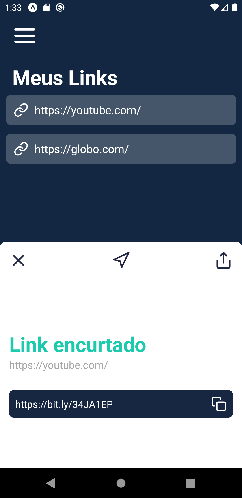

# MyLinks

## Sobre o Projeto 📚

Um encurtador de URL, como o nome sugere, serve para reduzir o tamanho de um link, compactando o endereço de uma página da web. ... Além de compactar o link, essas ferramentas também permitem rastrear o endereço eletrônico.

-----------------------------------------------------------

## Tecnologias Utilizadas 🚀
* React Native
* Expo
* Styled Components
* Hooks
* API Bitly
-----------------------------------------------------------

## Galeria 🖼️

     